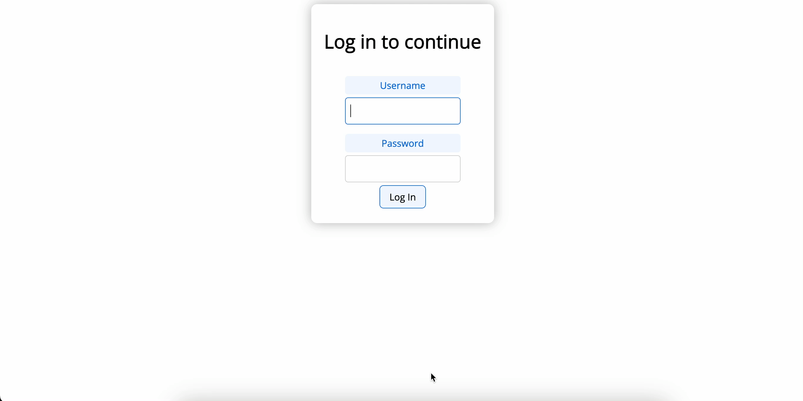
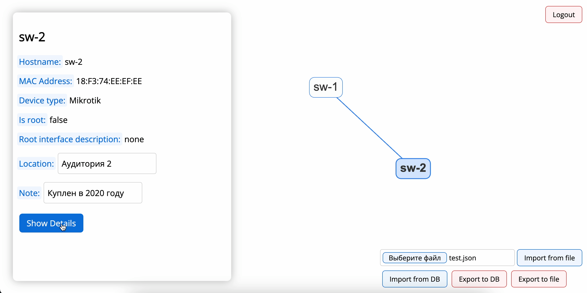
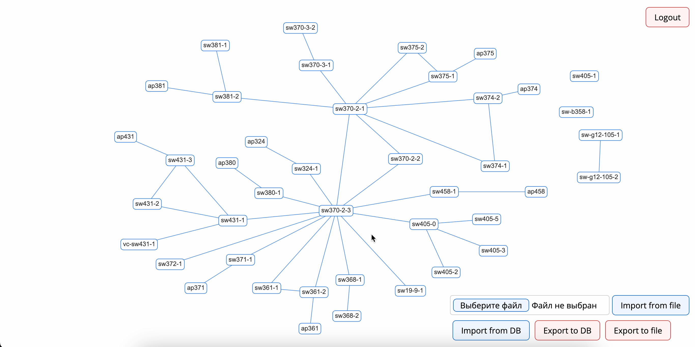

# LinkShape
React/Node.js-based network visualizer

## Features

- JWT-based authentication
- Network graph visualization
- Display basic device data
- Display basic connection data
- Supply devices with additional data (e.g. location, note)
- Zoom in and out, drag devices on the map (coordinates of each device are saved)
- Import/export network data via `.json` file or `PostgreSQL` database
- Export the graph picture (right-click on the map -> "Save picture as...")

## How to run
### Prerequisites
- Docker
- Docker compose
- React
- Node.js
### Backend
1. Start the example `PostgreSQL` database in a Docker container. It contains all necessary tables for devices and user
management, and an example set of devices/links/ifaces. Also initiates a user with pre-encoded password (creds: `KOT:KOT`)

```bash
cd backend/pg
docker compose up -d
```

2. Start the `Node.js` app
```bash
cd backend
node app.js
```

3. New users can be created via `reg.sh` script or directly through `/register` endpoint

### Frontend
1. Run the React app
```bash
cd frontend
npm start
```

## Screenshots
Login page:


Displaying the device data:


Example network:
